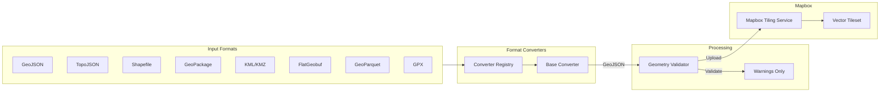
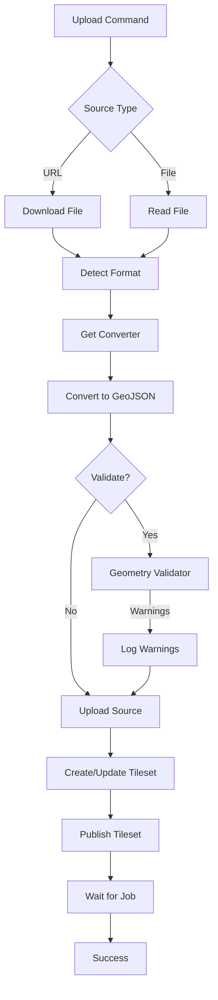

# Mapbox Tileset Uploader

A CLI tool and Python library to upload GIS data to Mapbox as vector tilesets. Supports multiple geospatial formats with a modular architecture.

[](https://badge.fury.io/py/mapbox-tileset-uploader)
[](https://www.python.org/downloads/)
[](https://opensource.org/licenses/MIT)

## Features

- 📤 Upload GIS files to Mapbox Tiling Service (MTS)
- 🗺️ **Multi-format support**: GeoJSON, TopoJSON, Shapefile, GeoPackage, KML/KMZ, FlatGeobuf, GeoParquet, GPX
- 🔍 **Geometry validation**: Warns about invalid geometries without modifying data
- 🌐 Download and upload from remote URLs
- 🔄 Automatic format detection and conversion to GeoJSON
- ⚙️ Configurable zoom levels, layer names, and recipes
- 🔧 Both CLI and Python API available
- 📦 Modular architecture with optional dependencies
- 🧩 Extensible converter system

## Installation

### Basic Installation (GeoJSON & TopoJSON only)

```bash
pip install mapbox-tileset-uploader
```

### With Optional Format Support

```bash
# Shapefile support
pip install mapbox-tileset-uploader[shapefile]

# GeoPackage, KML, FlatGeobuf support (via fiona)
pip install mapbox-tileset-uploader[fiona]

# GeoParquet support
pip install mapbox-tileset-uploader[geoparquet]

# GPX support
pip install mapbox-tileset-uploader[gpx]

# Geometry validation (via shapely)
pip install mapbox-tileset-uploader[validation]

# All formats and validation
pip install mapbox-tileset-uploader[all-formats]

# All features including dev tools
pip install mapbox-tileset-uploader[all]
```

### Install from Source

```bash
git clone https://github.com/im4sea/mapbox-tileset-uploader.git
cd mapbox-tileset-uploader
pip install -e ".[all]"
```

## Supported Formats

| Format | Extensions | Dependencies | Notes |
|--------|-----------|--------------|-------|
| GeoJSON | `.geojson`, `.json` | None | Native support |
| TopoJSON | `.topojson` | None | Full decoder with transform support |
| Shapefile | `.shp`, `.zip` | `pyshp` | Supports zipped shapefiles |
| GeoPackage | `.gpkg` | `fiona` | Supports layer selection |
| KML/KMZ | `.kml`, `.kmz` | `fiona` | Handles zipped KMZ |
| FlatGeobuf | `.fgb` | `fiona` | Cloud-optimized format |
| GeoParquet | `.parquet`, `.geoparquet` | `geopandas`, `pyarrow` | Columnar format |
| GPX | `.gpx` | `gpxpy` | Tracks, routes, waypoints |

Check available formats with:
```bash
mtu formats
```

## Architecture





## Prerequisites

1. **Mapbox Account**: Sign up at [mapbox.com](https://www.mapbox.com/)
2. **Access Token**: Create a token with the following scopes:
   - `tilesets:write`
   - `tilesets:read`
   - `tilesets:list`

Set your credentials as environment variables:

```bash
export MAPBOX_ACCESS_TOKEN="your-token-here"
export MAPBOX_USERNAME="your-username"
```

## CLI Usage

The package provides two command aliases: `mapbox-tileset-uploader` and `mtu` (short form).

### Upload from URL

```bash
mtu upload \
  --url https://example.com/data.geojson \
  --id my-tileset \
  --name "My Tileset"
```

### Upload from Local File

```bash
mtu upload \
  --file data.geojson \
  --id my-tileset \
  --name "My Tileset"
```

### Upload with Custom Options

```bash
mtu upload \
  --file data.topojson \
  --id boundaries-adm1 \
  --name "Administrative Boundaries Level 1" \
  --layer boundaries \
  --min-zoom 2 \
  --max-zoom 12 \
  --description "Admin level 1 boundaries" \
  --attribution "© OpenStreetMap contributors"
```

### Convert TopoJSON to GeoJSON

```bash
mtu convert input.topojson output.geojson --pretty
```

### Convert Any Supported Format

```bash
# Shapefile to GeoJSON
mtu convert boundaries.shp boundaries.geojson

# GeoPackage to GeoJSON
mtu convert data.gpkg output.geojson

# Zipped shapefile
mtu convert archive.zip output.geojson
```

### Validate GIS Files

Validate geometry without uploading:

```bash
mtu validate data.geojson
mtu validate boundaries.shp --verbose
```

### Show Available Formats

```bash
mtu formats
```

### Show Configuration Help

```bash
mtu info
```

### List Resources

```bash
# List all tileset sources
mtu list-sources

# List all tilesets
mtu list-tilesets
```

### Delete Resources

```bash
# Delete a tileset source
mtu delete-source my-source-id

# Delete a tileset
mtu delete-tileset my-tileset-id
```

### Dry Run Mode

Validate your file without uploading:

```bash
mtu upload --file data.geojson --id test --name "Test" --dry-run
```

## Python API Usage

```python
from mapbox_tileset_uploader import TilesetUploader
from mapbox_tileset_uploader.uploader import TilesetConfig

# Initialize uploader (uses environment variables by default)
uploader = TilesetUploader()

# Or provide credentials explicitly
uploader = TilesetUploader(
    access_token="your-token",
    username="your-username"
)

# Configure the tileset
config = TilesetConfig(
    tileset_id="my-tileset",
    tileset_name="My Tileset",
    layer_name="data",
    min_zoom=0,
    max_zoom=10,
    description="My geographic data"
)

# Upload from URL
results = uploader.upload_from_url(
    url="https://example.com/data.geojson",
    config=config
)

# Upload from local file
results = uploader.upload_from_file(
    file_path="data.geojson",
    config=config
)

if results.success:
    print(f"Tileset uploaded: {results.tileset_id}")
    if results.warnings:
        print(f"Warnings: {results.warnings}")
else:
    print(f"Error: {results.error}")
```

### Upload with Validation

```python
# Enable geometry validation (warns but doesn't modify data)
uploader = TilesetUploader(validate_geometry=True)

results = uploader.upload_from_file("data.geojson", config)

# Check validation results
if results.validation_result:
    for warning in results.validation_result.warnings:
        print(f"  [{warning.severity}] {warning.message}")
```

### Using Format Converters

```python
from mapbox_tileset_uploader.converters import get_converter, get_supported_formats

# List available formats
formats = get_supported_formats()
for fmt in formats:
    status = "✓" if fmt["available"] else "✗ (missing deps)"
    print(f"{fmt['format_name']}: {status}")

# Convert any supported format
converter = get_converter(file_path="data.shp")  # Auto-detect by extension
result = converter.convert("data.shp")

print(f"Converted {result.feature_count} features from {result.source_format}")
print(f"Warnings: {result.warnings}")

# Or specify format explicitly
converter = get_converter(format_name="geopackage")
result = converter.convert("data.gpkg", layer_name="boundaries")
```

### Geometry Validation

```python
from mapbox_tileset_uploader import validate_geojson, GeometryValidator

# Quick validation
result = validate_geojson(geojson_data)
print(f"Valid: {result.valid}, Features: {result.feature_count}")

# Custom validation options
validator = GeometryValidator(
    check_coordinates=True,   # Check coordinate bounds
    check_winding=True,       # Check polygon winding order  
    check_duplicates=True,    # Check duplicate vertices
    check_closure=True,       # Check ring closure
    check_intersections=True, # Check self-intersections (requires shapely)
    max_warnings=100          # Limit warnings
)

result = validator.validate(geojson_data)
for warning in result.warnings:
    print(f"Feature {warning.feature_index}: {warning.message}")
```

### TopoJSON Conversion

```python
from mapbox_tileset_uploader.converters import get_converter

# Convert TopoJSON to GeoJSON
converter = get_converter(format_name="topojson")
result = converter.convert(topojson_data)
geojson = result.geojson

# From file
result = converter.convert("data.topojson")

# Select specific object in TopoJSON
result = converter.convert(topojson_data, object_name="countries")
```

## Custom Recipes

For advanced configurations, provide a custom MTS recipe:

```bash
mtu upload \
  --file data.geojson \
  --id my-tileset \
  --name "My Tileset" \
  --recipe custom-recipe.json
```

Recipe file example (`custom-recipe.json`):

```json
{
  "version": 1,
  "layers": {
    "boundaries": {
      "source": "mapbox://tileset-source/{username}/{source-id}",
      "minzoom": 0,
      "maxzoom": 14,
      "features": {
        "simplify": {
          "outward_only": true,
          "distance": 1
        }
      }
    }
  }
}
```

## GitHub Actions Integration

Use in your CI/CD pipeline:

```yaml
name: Upload Tilesets

on:
  push:
    branches: [main]
  workflow_dispatch:

jobs:
  upload:
    runs-on: ubuntu-latest
    steps:
      - uses: actions/checkout@v4

      - name: Set up Python
        uses: actions/setup-python@v5
        with:
          python-version: "3.11"

      - name: Install dependencies
        run: pip install mapbox-tileset-uploader

      - name: Upload tileset
        env:
          MAPBOX_ACCESS_TOKEN: ${{ secrets.MAPBOX_ACCESS_TOKEN }}
          MAPBOX_USERNAME: ${{ secrets.MAPBOX_USERNAME }}
        run: |
          mtu upload \
            --file data.geojson \
            --id my-tileset \
            --name "My Tileset"
```

## Development

### Setup

```bash
git clone https://github.com/im4sea/mapbox-tileset-uploader.git
cd mapbox-tileset-uploader
pip install -e ".[all]"
```

### Run Tests

```bash
pytest
```

### Code Formatting

```bash
black src tests
ruff check src tests
```

### Type Checking

```bash
mypy src
```

## License

MIT License - see [LICENSE](LICENSE) for details.

## Contributing

Contributions are welcome! Please feel free to submit a Pull Request.

## Related Projects

- [mapbox-tilesets](https://github.com/mapbox/tilesets-cli) - Official Mapbox Tilesets CLI
- [geoBoundaries](https://www.geoboundaries.org/) - Open political boundary data
